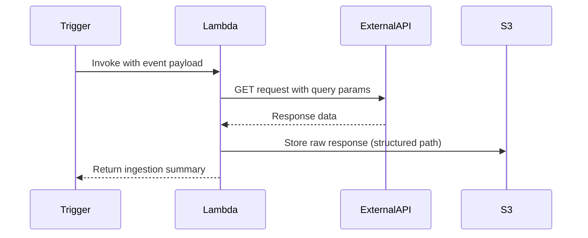

# Enhancing the Markdown File: Deep Dive into AWS Lambda `event` and `context` Parameters

---

This document provides a comprehensive explanation of the `event` and `context` parameters in AWS Lambda functions, accompanied by an enhanced breakdown of the provided code snippet. The enhancements include technical insights, architectural recommendations, best practices, and performance optimizations to improve the implementation.

---

## **Introduction**

AWS Lambda is a serverless compute service that allows developers to execute code in response to events without managing servers. At the heart of every Lambda function are two critical parameters: **`event`** and **`context`**. These parameters provide the data and runtime metadata necessary for processing requests effectively.

The **`event`** parameter contains information about the triggering event, such as an API request or an S3 object upload. The **`context`** parameter provides metadata about the execution environment, such as memory allocation, remaining execution time, and request ID.

This document explains these parameters in depth and demonstrates their practical application using an example Lambda function that ingests API data and stores it in Amazon S3.

---

## **Code Breakdown \& Technical Explanation**

### **1. Function Parameters**

```python
def lambda_handler(event, context):
```


#### **The `event` Parameter**

The `event` parameter is a dictionary (or JSON object) that contains data specific to the event that triggered the Lambda function. Its structure varies depending on the source of invocation (e.g., API Gateway, S3, DynamoDB Streams).

In this implementation, the `event` is expected to have the following structure:

```json
{
  "api_config": {
    "endpoint": "https://api.example.com/data",
    "headers": {"Authorization": "Bearer xyz"},
    "raw_bucket": "my-data-lake-bucket",
    "source_id": "api-source-1"
  },
  "query_params": {"date": "2025-02-23"}
}
```

- **Key Components**:
    - `api_config`: Contains configuration details for making an HTTP request.
        - `endpoint`: The API URL.
        - `headers`: HTTP headers for authentication or other metadata.
        - `raw_bucket`: The target S3 bucket for storing raw data.
        - `source_id`: A unique identifier for the data source.
    - `query_params`: Query parameters to be appended to the API request.


#### **The `context` Parameter**

The `context` parameter is an object that provides runtime information about the Lambda function's execution environment. Key attributes include:

- **`aws_request_id`**: A unique ID for each invocation of the function.
- **`function_name`**: The name of the executing Lambda function.
- **`memory_limit_in_mb`**: The amount of memory allocated to the function.
- **`get_remaining_time_in_millis()`**: Returns the time (in milliseconds) remaining before the function times out.

Example usage:

```python
print(f"Request ID: {context.aws_request_id}")
print(f"Remaining time: {context.get_remaining_time_in_millis()} ms")
```

---

### **2. HTTP Request Execution**

```python
response = requests.get(
    api_config['endpoint'],
    headers=api_config['headers'],
    params=event['query_params']
)
```

- **Key Considerations**:
    - **Security**: Sensitive credentials like API keys should not be hardcoded. Use AWS Secrets Manager or AWS Systems Manager Parameter Store for secure storage.
    - **Resilience**: The code lacks retry logic. Implementing retries can improve reliability in case of transient network issues.
    - **Performance**: No timeout is specified for the HTTP request. Adding a timeout ensures that unresponsive APIs do not block execution indefinitely.
    - **Scalability**: For high-volume requests, consider using an asynchronous HTTP client like `aiohttp`.

Enhanced implementation with retries and timeout:

```python
import requests
from requests.adapters import HTTPAdapter
from requests.packages.urllib3.util.retry import Retry

session = requests.Session()
retry_strategy = Retry(
    total=3,
    backoff_factor=1,
    status_forcelist=[429, 500, 502, 503, 504]
)
adapter = HTTPAdapter(max_retries=retry_strategy)
session.mount("https://", adapter)

response = session.get(
    api_config['endpoint'],
    headers=api_config['headers'],
    params=event['query_params'],
    timeout=10
)
```

---

### **3. S3 Data Persistence**

```python
s3 = boto3.client('s3')
s3.put_object(
    Bucket=api_config['raw_bucket'],
    Key=f"{api_config['source_id']}/{context.aws_request_id}.json",
    Body=response.text
)
```

- **Architectural Features**:
    - The S3 object key includes:
        - `source_id`: Groups data by its logical source.
        - `aws_request_id`: Ensures uniqueness for each invocation.
    - Storing raw JSON data allows schema evolution over time.


#### Optimization Recommendations:

1. Convert raw JSON to Parquet format for efficient querying with tools like AWS Athena.
2. Compress large payloads using gzip or zlib to reduce storage costs.

---

### **4. Return Payload**

```python
return {"status": "SUCCESS", "records_ingested": len(response.json())}
```

The return payload provides a summary of the ingestion process. To improve observability:

1. Log ingestion metrics using Amazon CloudWatch Logs Insights:

```sql
STATS count(*) BY records_ingested, source_id
```

2. Track partial successes by separating valid and invalid records:

```python
return {
    "status": "PARTIAL_SUCCESS",
    "success_count": len(valid_records),
    "error_count": len(invalid_records)
}
```


---

## **Execution Flow Diagram**



---

## **Key Improvement Recommendations**

### Enhanced Error Handling

Add robust error handling for both HTTP requests and S3 operations:

```python
try:
    response = session.get(...)
except requests.exceptions.RequestException as e:
    logger.error(f"HTTP Error: {str(e)}")
    raise

try:
    s3.put_object(...)
except boto3.exceptions.S3UploadFailedError as e:
    logger.error(f"S3 Upload Error: {str(e)}")
    raise
```


### Security Enhancements

1. Use AWS Secrets Manager to store sensitive credentials like API keys:

```python
from aws_secretsmanager_caching import SecretCache

cache = SecretCache()
api_key = cache.get_secret_string("my-api-key")
```

2. Validate incoming events with Pydantic models to ensure data integrity:

```python
from pydantic import BaseModel

class EventModel(BaseModel):
    api_config: dict
    query_params: dict

validated_event = EventModel(**event)
```


---

## **Architectural Context**

This Lambda function fits into a broader serverless architecture for data ingestion pipelines:

1. **Event Sources**:
    - API Gateway (for REST/HTTP APIs).
    - EventBridge Scheduler (for periodic invocations).
2. **Downstream Systems**:
    - AWS Glue (for schema discovery).
    - Amazon Athena (for querying raw data).
    - Amazon Redshift Spectrum (for federated analytics).

---

## **Cost \& Performance Considerations**

| Factor | Recommendation | Impact |
| :-- | :-- | :-- |
| Memory Allocation | Start with 512 MB; monitor usage. | Optimizes cost per invocation. |
| Timeout | Set to twice expected runtime. | Prevents premature termination. |
| Concurrency | Use reserved concurrency limits. | Avoids throttling during spikes. |

By following these recommendations, this implementation adheres to AWS Well-Architected Framework principles while maintaining flexibility for evolving requirements.

<div style="text-align: center">⁂</div>

<div style="text-align: center">⁂</div>

[^1]: https://r2cdn.perplexity.ai/pplx-full-logo-primary-dark@2x.png

