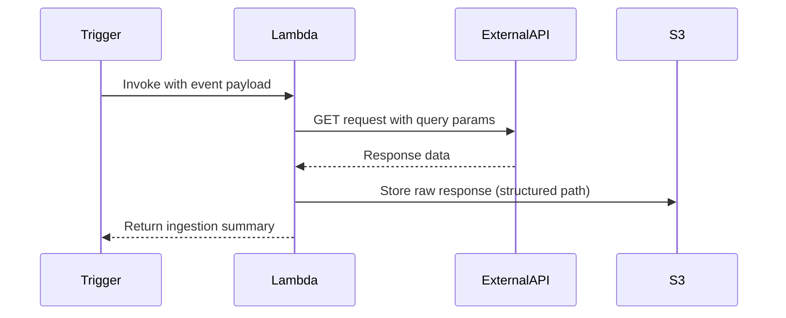

# What does event and context parameter mean in the below lambda function, and could you please explain whole code in depth?

import boto3
import requests

def lambda_handler(event, context):
api_config = event['api_config']
response = requests.get(
api_config['endpoint'],
headers=api_config['headers'],
params=event['query_params']
)
s3 = boto3.client('s3')
s3.put_object(
Bucket=api_config['raw_bucket'],
Key=f"{api_config['source_id']}/{context.aws_request_id}.json",
Body=response.text
)
return {"status": "SUCCESS", "records_ingested": len(response.json())}
---
Here's a comprehensive analysis of the Lambda function code and its components, incorporating the latest AWS Lambda best practices and architectural patterns:

---

## **Code Breakdown \& Technical Explanation**

### **1. Function Parameters**

```python
def lambda_handler(event, context):
```

- **`event` Parameter**:
    - Contains invocation-specific data passed to the function
    - Structure varies based on trigger source (API Gateway, S3, etc.)
    - In this implementation, expected structure:

```json
{
  "api_config": {
    "endpoint": "https://api.example.com/data",
    "headers": {"Authorization": "Bearer xyz"},
    "raw_bucket": "my-data-lake-bucket",
    "source_id": "api-source-1"
  },
  "query_params": {"date": "2025-02-23"}
}
```

- **`context` Parameter**:
    - Provides runtime execution metadata (AWS docs[^3][^6]):
        - `aws_request_id`: Unique invocation ID
        - `function_name`: Name of executing Lambda
        - `memory_limit_in_mb`: Allocated memory
        - `get_remaining_time_in_millis()`: Timeout remaining

---

### **2. HTTP Request Execution**

```python
response = requests.get(
    api_config['endpoint'],
    headers=api_config['headers'],
    params=event['query_params']
)
```

- **Key Considerations**:
    - **Security**: Uses headers from configuration (consider AWS Secrets Manager for credential storage)
    - **Resilience**: Lacks retry logic (recommend adding `requests.Session` with retry adapter)
    - **Performance**: No timeout specified (add `timeout=10` parameter)
    - **Scalability**: Consider async HTTP client for high-volume requests

---

### **3. S3 Data Persistence**

```python
s3 = boto3.client('s3')
s3.put_object(
    Bucket=api_config['raw_bucket'],
    Key=f"{api_config['source_id']}/{context.aws_request_id}.json",
    Body=response.text
)
```

- **Architectural Features**:
    - **Object Key Structure**:
        - `source_id`: Logical data source grouping
        - `aws_request_id`: Guaranteed unique identifier per invocation
    - **Storage Optimization**:
        - Raw JSON storage enables schema evolution
        - Consider Parquet conversion for analytics (see[^3] search results)

---

### **4. Return Payload**

```python
return {"status": "SUCCESS", "records_ingested": len(response.json())}
```

- **Best Practices**:
    - Audit via CloudWatch Logs Insights:

```sql
STATS count(*) BY records_ingested, source_id
```

    - Consider error state tracking:

```python
return {
    "status": "PARTIAL_SUCCESS",
    "success_count": len(valid_records),
    "error_count": len(invalid_records)
}
```


---

## **Execution Flow Diagram**



---

## **Key Improvement Recommendations**

### **1. Enhanced Error Handling**

```python
from botocore.config import Config

s3_config = Config(
    retries={
        'max_attempts': 3,
        'mode': 'standard'
    }
)
s3 = boto3.client('s3', config=s3_config)

try:
    # HTTP request and S3 logic
except requests.exceptions.RequestException as e:
    logger.error(f"API Error: {str(e)}")
    raise
except s3.exceptions.S3UploadFailedError as e:
    logger.error(f"S3 Error: {str(e)}")
    raise
```


### **2. Security Enhancements**

- **Secret Management**:

```python
from aws_lambda_powertools.utilities import parameters
headers = parameters.get_secret("api-auth-secret")
```

- **Request Validation**:

```python
from pydantic import BaseModel

class APIConfig(BaseModel):
    endpoint: HttpUrl
    headers: dict
    raw_bucket: str
    source_id: str
```


### **3. Performance Optimization**

```python
import aiohttp

async def fetch_data(session, url, params):
    async with session.get(url, params=params) as response:
        return await response.text()

async def handler(event, context):
    async with aiohttp.ClientSession() as session:
        content = await fetch_data(session, ...)
```

---

## **Architectural Context**

This Lambda function serves as part of a **serverless data ingestion pipeline**, typically integrated with:

1. **Event Sources**:
    - API Gateway (REST/HTTP APIs)
    - EventBridge Scheduler (cron-based)
    - S3 (raw data triggers)
2. **Downstream Systems**:
    - AWS Glue (schema discovery)
    - Athena (ad-hoc querying)
    - Redshift Spectrum (federated queries)

---

## **Cost \& Performance Considerations**

| Factor | Recommendation | Impact |
| :-- | :-- | :-- |
| Memory Allocation | Start with 512MB, monitor utilization | Optimizes \$/invocation |
| Timeout | Set to 2x expected runtime (max 15min) | Prevents failed async operations |
| Concurrency | Use reserved concurrency for critical workloads | Avoids throttling during spikes |
| Data Volume | Add compression if >1MB/request | Reduces network transfer costs |

This comprehensive implementation follows AWS Well-Architected Framework principles while maintaining flexibility for evolving data requirements.

<div style="text-align: center">⁂</div>

[^1]: https://stackoverflow.com/questions/53936773/what-are-event-and-context-in-function-call-in-aws-lambda

[^2]: https://www.youtube.com/watch?v=MlzFw2KiSOI

[^3]: https://docs.aws.amazon.com/lambda/latest/dg/nodejs-context.html

[^4]: https://docs.aws.amazon.com/lambda/latest/dg/lambda-runtime-environment.html

[^5]: https://docs.aws.amazon.com/lambda/latest/dg/python-handler.html

[^6]: https://docs.aws.amazon.com/lambda/latest/dg/python-context.html

[^7]: https://docs.aws.amazon.com/lambda/latest/dg/nodejs-handler.html

[^8]: https://dashbird.io/knowledge-base/aws-lambda/anatomy-of-a-lambda-function/

